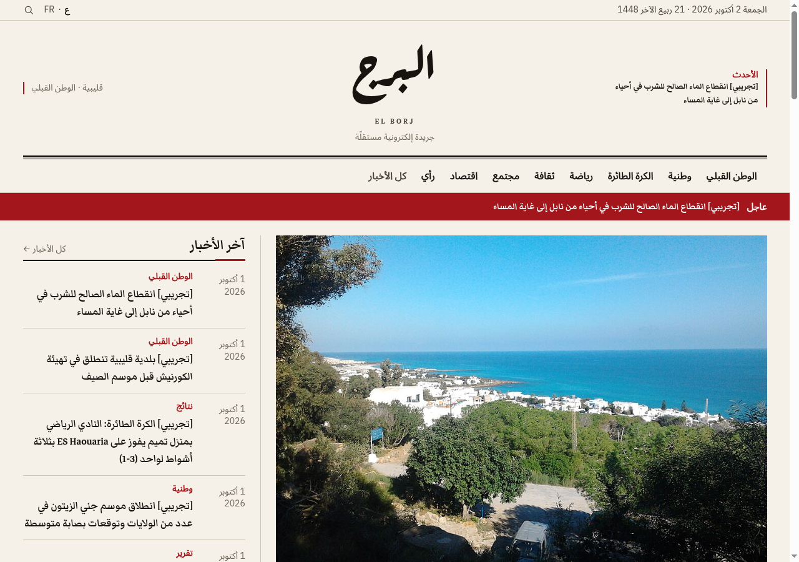
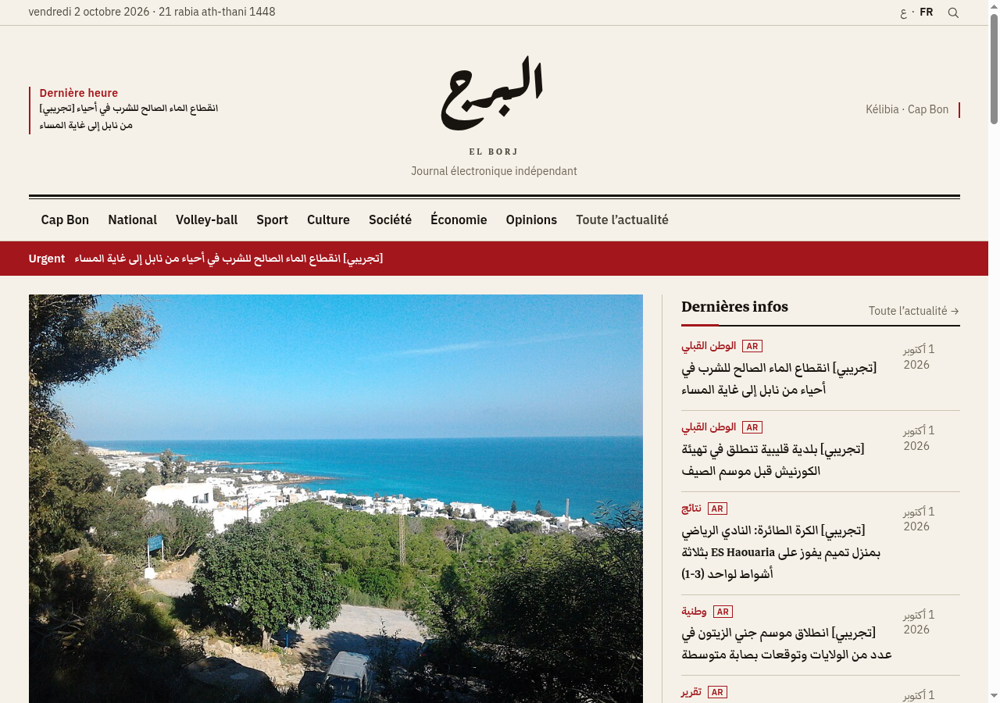
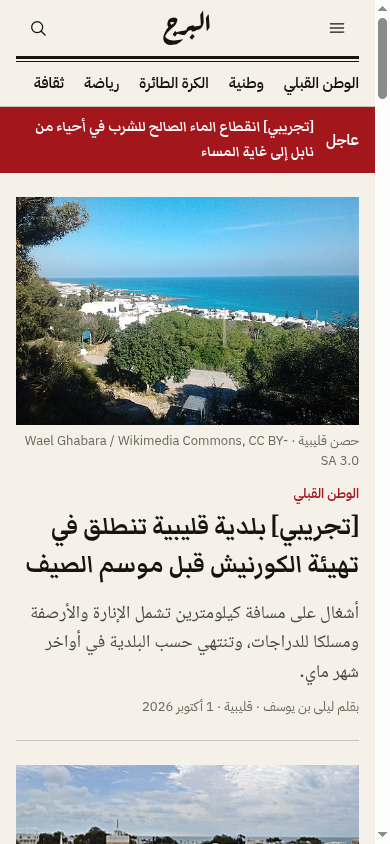
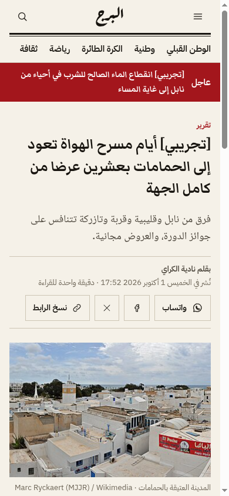
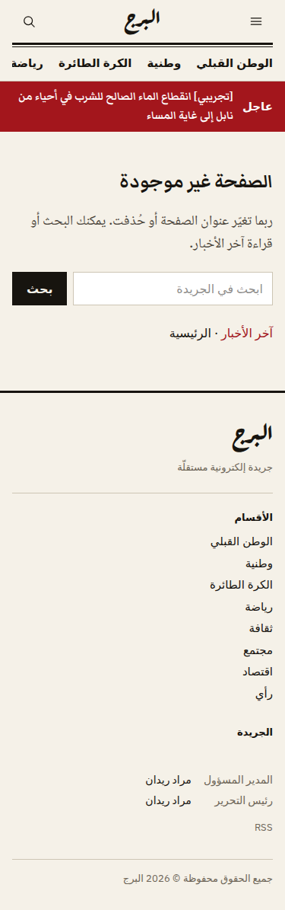
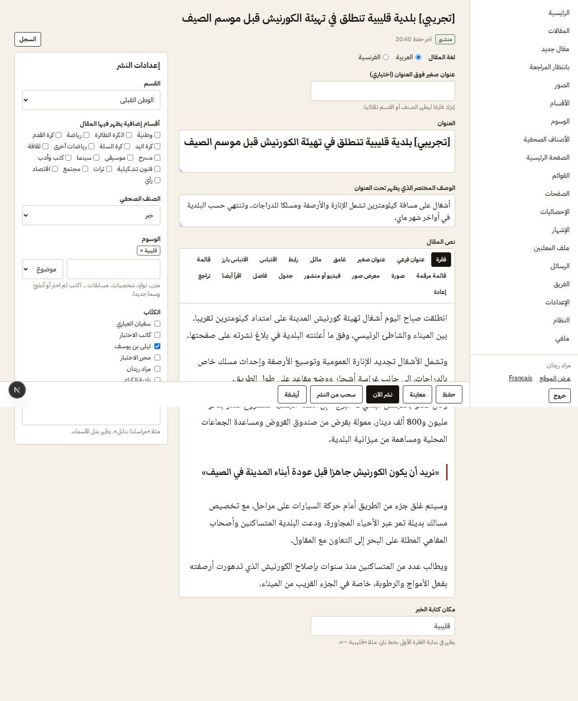
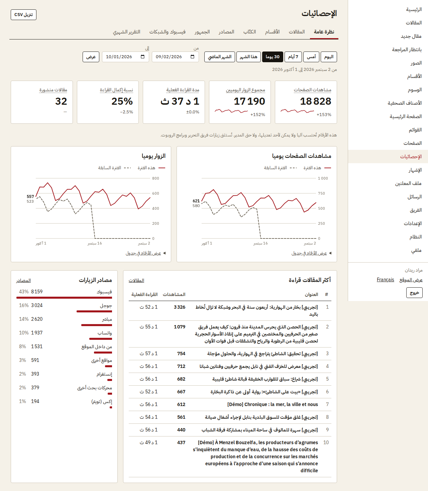
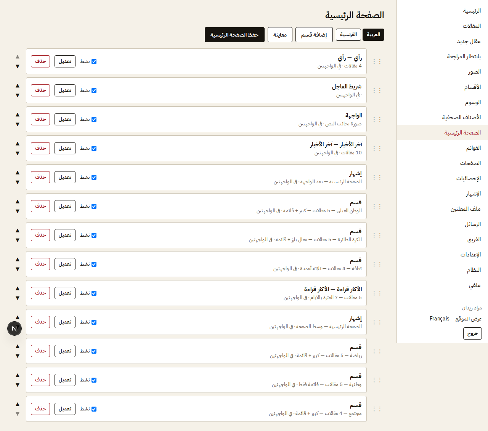
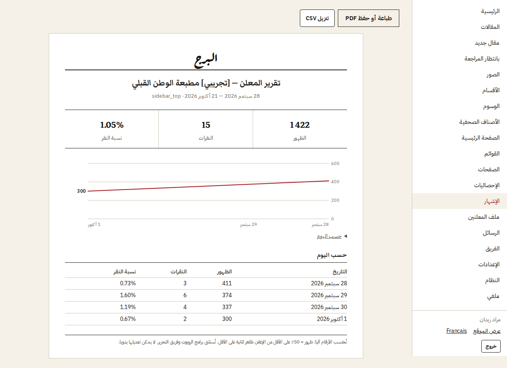

# El Borj (working name) — online newspaper

Arabic-first (RTL) and French online newspaper for Mourad Ridene: public site, admin/CMS,
first-party statistics that nobody can edit, sponsor ads and a live media kit. Next.js on
Cloudflare Workers (free plan) + Supabase (free plan).

**Live (test address):** https://www.elborj.workers.dev — admin at
`/ar/admin/login`. The screenshots below show the demo content used during development (removed
from the live site with `supabase/demo-clear.sql`).

## Screenshots

| Homepage (Arabic, desktop) | Accueil (français) |
|---|---|
|  |  |

| Homepage (phone) | Article (phone) | Media kit for advertisers |
|---|---|---|
|  |  |  |

| Article editor (admin) | Statistics (admin, simulated local traffic) |
|---|---|
|  |  |

| Homepage builder | Sponsor report |
|---|---|
|  |  |

Public pages: taken on the live site (2026-10-02). Admin screens: from the build
(`docs/screenshots/phase*/`, more there), with simulated local readers for the statistics.

## Start here

| You want to… | Read |
|---|---|
| Put it online | `supabase/APPLY.md` (database), then `docs/DEPLOY.md` (Cloudflare) |
| Move to the $5 Cloudflare plan | `docs/WORKERS-PAID.md` (what to switch back in the code) |
| Launch it | `docs/LAUNCH.md` |
| Know what was built and what's left for you | `docs/PROGRESS.md` (ends with "What Firas needs to do") |
| Know why things are the way they are | `docs/DECISIONS.md` |
| Continue development with Claude Code | `CLAUDE.md`, `docs/HANDOFF.md`, and the `MODULE.md` in each folder (`supabase/MODULE.md` = the database) |

## Run it locally

Needs Node 22 and pnpm 10.

**Against the online Supabase project** (simplest; what Firas uses): copy `.env.example`
to `.env.local`, fill in the project URL, anon/publishable key, secret key and two random
strings (`openssl rand -hex 32`), then `pnpm install && pnpm dev`. Don't run
`pnpm test:db` or `pnpm dev:traffic` against it (they reset or fake statistics).

**With a local database** (needs Docker; required for `pnpm test:db` and the e2e tests):

```bash
pnpm install
npx supabase start                 # local database; prints the local keys
cp .env.example .env.local         # put the local URL/keys in it (see docs/HANDOFF.md)
pnpm db:local-reset                # migrations + seed + demo content + 3 test users
pnpm dev:traffic                   # optional: 45 days of simulated readers (local only)
pnpm dev                           # http://localhost:3000  — admin: /ar/admin/login
```

Test users (local only): `admin@elborj.test`, `editor@elborj.test`, `author@elborj.test`,
password `local-dev-password`.

## Commands

| Command | What it does |
|---|---|
| `pnpm lint` / `pnpm typecheck` / `pnpm test` | ESLint (incl. RTL rule), TypeScript, unit tests |
| `pnpm test:db` | SQL tests against the local database (RLS, statistics lock, rollups…) |
| `pnpm build && pnpm start` then `E2E_NO_SERVER=1 pnpm test:e2e` | Playwright end-to-end tests |
| `pnpm db:bundle` | Rebuilds `supabase/ALL_MIGRATIONS.sql` from the numbered migrations |
| `pnpm db:demo` | Regenerates `supabase/demo-seed.sql` |
| `pnpm build:cf` / `pnpm bundle:size` | Cloudflare build, Worker size check (free plan: 3 MiB gzip) |
| `pnpm run deploy` | Build without local secrets and deploy (`scripts/deploy.sh`; not `pnpm deploy`, which is a pnpm built-in) |
| `bash scripts/backup.sh` | Database backup (see DEPLOY.md §8) |
| `bash scripts/lighthouse-median.sh <url>` | Lighthouse mobile, median of 3 runs |

## Costs

- Cloudflare Workers free plan + Supabase free plan: 0 TND/month. Domain: yearly fee.

## Upgrade path (only when needed)

| Sign | Upgrade | Cost (list prices when written; check before buying) |
|---|---|---|
| More than ~100k page requests a day, error 1102 or "Too many subrequests" in the Workers logs | Cloudflare **Workers Paid** (10 million requests/month, 30 s CPU, 10,000 subrequests) — see `docs/WORKERS-PAID.md` | $5/month |
| Database near 500 MB, storage near 1 GB, need real backups or no pausing | **Supabase Pro** (8 GB DB, 100 GB storage, daily backups, no pausing) | $25/month |
| Login e-mails limited | A free SMTP provider in Supabase Auth (no upgrade needed) | free |
| Error alerts wanted | Sentry free tier | free |

Nothing in the code has to change for these upgrades; `docs/WORKERS-PAID.md` lists optional improvements once on Workers Paid.

## Things to confirm with your dad (can be changed later in the admin, no code)

- [ ] Name of the paper (working: «البرج» / El Borj; alternatives: «الشّراع», «المنارة»)
- [ ] Tagline
- [ ] Section list (seeded with: الوطن القبلي، وطنية، الكرة الطائرة، رياضة، ثقافة، مجتمع، اقتصاد، رأي)
- [ ] Is «أبو فراس» still a signature he wants to use? (can be a byline override)
- [ ] Legal masthead: who is المدير المسؤول and رئيس التحرير, address, contact
- [ ] Whether the publication needs to be declared anywhere in Tunisia (ask SNJT or a lawyer)
- [ ] Domain name (check availability of the chosen name in `.tn` and `.com`)

## What's in `docs/`

| File | Content |
|---|---|
| 01-product.md | Vision, positioning, roles, scope |
| 02-design-system.md | Visual direction from the research, tokens, fonts, components, banned "AI look" patterns |
| 03-architecture.md | Stack, Cloudflare/OpenNext, i18n, caching, media, auth, security |
| 04-database.md | Full schema, seed data, RLS, cron jobs, migration deliverables |
| 05-public-site.md | Every public page |
| 06-admin-cms.md | Every admin screen, including categories and homepage builder |
| 07-analytics-and-monetization.md | Tracker, dashboards, per-author stats, GA4, AdSense, sponsors, media kit |
| 08-seo-legal-ops.md | SEO, feeds, legal pages, deployment, backups, launch checklist |
| 09-build-plan.md | Phases, checks, stop points |
| DEPLOY.md, WORKERS-PAID.md, LAUNCH.md | Deploying, the $5 plan, launch checklist |
| HANDOFF.md, PROGRESS.md, DECISIONS.md | Current state, what was built, why |
| research/tunisian-press-notes.md | What Tunisian news sites look like, and what we keep or avoid |
